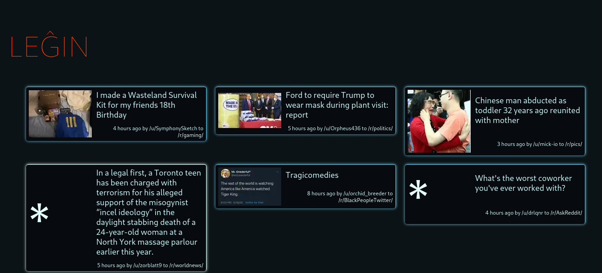

# Legxin

Legxin is an alternative UI for reddit. The goals are simple:

- Make programming fun again
I need to enjoy doing this. If I don't (hint: if I need to implement something I'm not interested in) I will quickly lose interest in it.

- Teach me [svelte](https://svelte.dev/) and web technologies
You can't be fullstack until you've succesfully centered a div. Also, svelte looks cool, so why not ?

- Be lightweight on the network
For some reason the standard UI (on old.reddit.com) retrieves ~1MB per page. Legxin uses the reddit API directly, so the data _should_ be smaller.

- Have a different UI/UX
I don't want to repeat standard themes of UI we have seen again and again and again, I want to do something different. Even though I'm no web designer, and that shows.
If legxin has subtle tron-like resemblances, this is totally expected.

## Status

Very bare: only the 25 hottest submissions of a subreddit (or /r/all/) are visible. No submission view. No commenting, voting, etc...

## Screenshots



2 things to note:
- The selected item has a different border
- Items with no thumbnail have a giant '*' instead of the image

## Compatibility issues

For some reason CORS handling under Firefox and Chromium is not the same, and Firefox doesn't allow you to call the Reddit API from a script; because of this you must use Chromium (or any derivative, but I test under Chromium only). This pains me a lot because I wish to use Firefox only.

## Get started
*Note that you will need to have [Node.js](https://nodejs.org) installed.*

Install the dependencies...

```bash
cd legxin
npm install
```

...then start [Rollup](https://rollupjs.org):

```bash
npm run dev
```

Navigate to [localhost:5000](http://localhost:5000). You should see legxin running. 

1. Click on the "Login" button
2. Once redirected to reddit, click on "Allow" (if you want to)
3. You are redirected back to legxin, browse as you like

You can click on a given subreddit to display submissions from there. As you can see the url for navigating is a param, "subreddit", with the value being the subreddit you wish to see without the preceding "/r/".

## What's in a name
Legxin is a ASCII-compliant spelling of leĝin, which is a contraction of "legis ĝin", which roughly translate to "[I] read it" in Esperanto. Naming is hard.
